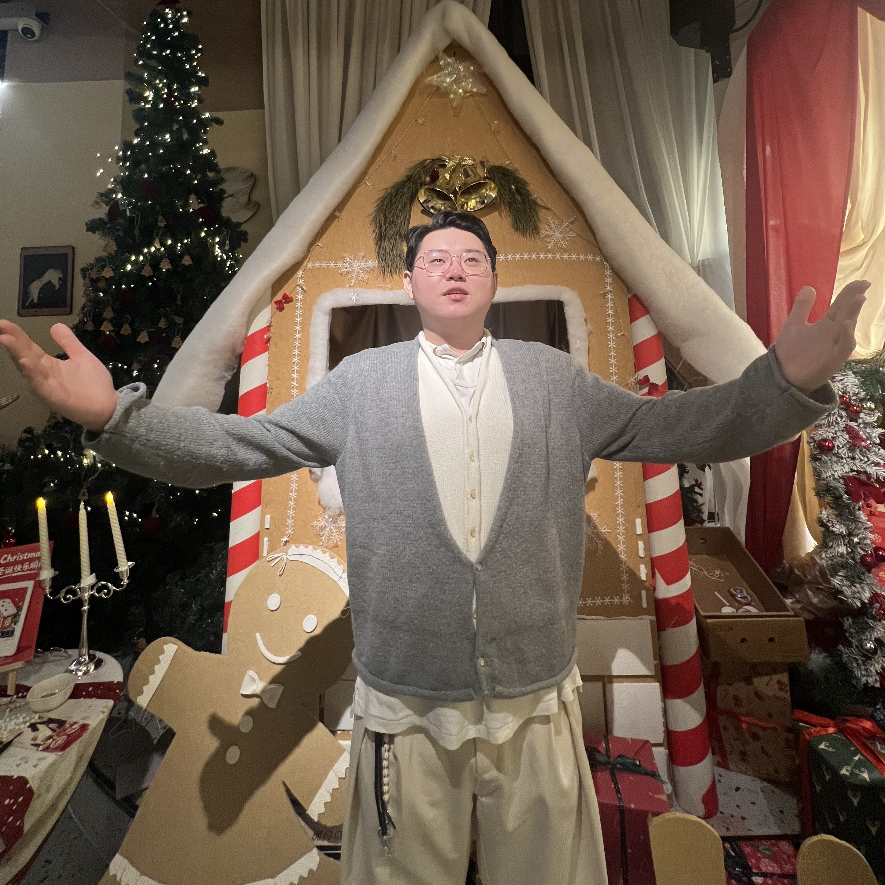

:::: {.home-wrap}

::: {.hcard .home-left}

Haochen (Jerry) Li

M.S. Student in Stat @ Duke

<a href="mailto:h.li@duke.edu">h.li@duke.edu</a>

  <a href="mailto:h.li@duke.edu" title="Email"><i class="bi bi-envelope-fill"></i></a>
  <a href="https://github.com/jerrylhc0513" title="GitHub"><i class="bi bi-github"></i></a>
  <a href="https://www.linkedin.com/in/haochen-li-690ba3300" title="LinkedIn"><i class="bi bi-linkedin"></i></a>

:::

::: {.home-right}

::: {.hcard .hcard-about}
## About Me

I am an M.S. student in Statistical Science at Duke University. My research interests lie in the theory and applications of machine learning and deep learning, with a focus on time-series and sequential data.
:::

::: {.hcard}
## Education

  
Duke University

  
M.S. in Statistical Science

  
Aug. 2026 – May 2028

  
University College London

  
M.Sc. in Computational Finance, Distinction

  
Sep. 2025 – Sep. 2026

  
University College London

  
B.Sc. in Mathematics with Economics, First-Class Honours

  
Sep. 2022 – Jul. 2025

:::

::: {.hcard}
## Experience

  
HSBC, London, UK

  
Quantitative Research Intern

  
May 2026 – Sep. 2026

  
KPMG, Guangzhou, China

  
Strategy Consulting Intern

  
Jun. 2025 – Sep. 2025

:::

::: {.hcard}
## Selected Studies

  
When Does Softmax Attention Outperform Linear Prediction in Nonlinear Time Series?

  
Haochen Li and Anru Zhang · Manuscript in preparation

  
<a href="https://doi.org/10.1109/AETCSE69203.2026.11504053">Research on Lightweight Detection Algorithms for Unsafe Passenger Behavior on Escalators</a>

  
2026 9th International Conference on Advanced Electronic Technology, Computers and Software Engineering

  
<a href="https://doi.org/10.21203/rs.3.rs-8607246/v1">Integrating Convexity and DeepLabv3+ for Semantic Segmentation of Power Lines</a>

  
Research Square preprint, 2026 · under review

[View all research](research.qmd)

:::

::: {.hcard}
## Research Areas

::: {.research-areas}
- Statistical learning theory
- Machine learning
- Deep learning
- Time-series forecasting
- Probabilistic forecasting
- Transformers and attention
- Flow matching
- Generative modeling
:::
:::

:::

::::