

::: {.project-intro}
These projects reflect my work across applied machine learning, mathematics, statistics, data sciene, quantitative finance and economics. My approach is to begin with careful data construction, compare complex methods against credible baselines, preserve realistic time ordering, and connect model outputs to interpretable decisions.
:::

## 01 · Probabilistic Intraday Volume and Volatility Forecasting {#project-hsbc}

::: {.project-meta}
HSBC Quantitative Research · UCL MSc Dissertation · 2026
:::

::: {.project-lead}
I replicated the Intraday Volume Estimator of Lee and Park (2024) on current U.S. equity data, then extended it across asset classes to G10 foreign exchange and across targets from intraday volume to realized volatility. The objective was not only predictive accuracy, but a probabilistic forecasting system whose information set and execution logic remain valid during the trading day.
:::

:::: {.project-summary-grid}
::: {.summary-panel}
### Model and data

- Two-tower encoder–decoder Transformer with Time2Vec embeddings and a Student-t density head.
- Twenty U.S. equities and five G10 FX pairs, with volume and Garman–Klass volatility targets.
- Shared evaluation against Linear, XGBoost, RNN, LSTM, BiLSTM, and historical-mean baselines.
:::

::: {.summary-panel}
### Main findings

- Identified four end-of-day look-ahead inputs and replaced them with information available in real time.
- Model rankings depended on the target: the Transformer was strongest for volatility, while a compact recurrent baseline led equity-volume forecasting.
- The causal FX schedule achieved 0.33 bp mean absolute VWAP tracking error, compared with 1.31 bp for the historical schedule and 1.66 bp for TWAP.
:::
::::

::: {.project-tools}
`PyTorch` `Transformers` `Probabilistic forecasting` `Market microstructure` `G10 FX` `VWAP execution` `Time series`
:::

:::: {.figure-grid .cols-3}
::: {.figure-item}
[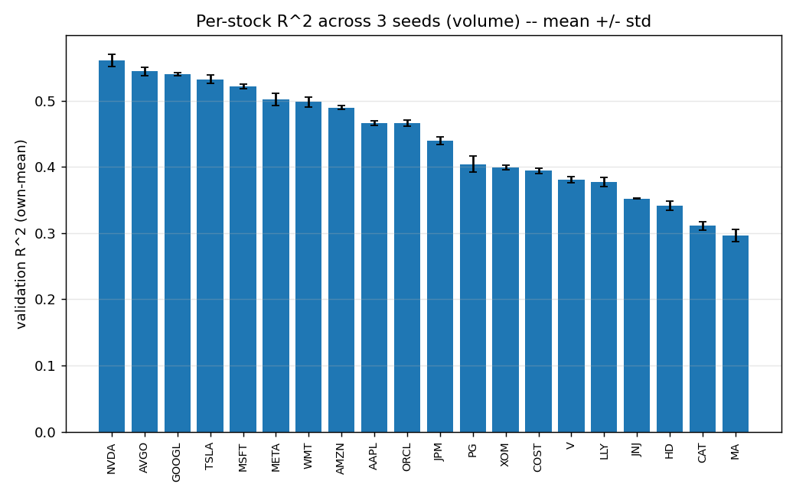{fig-alt="Mean validation R-squared by equity"}](fig/projects/hsbc-equity-r2-by-stock.png)

*Mean validation R² across three seeds for twenty U.S. equities.*
:::

::: {.figure-item}
[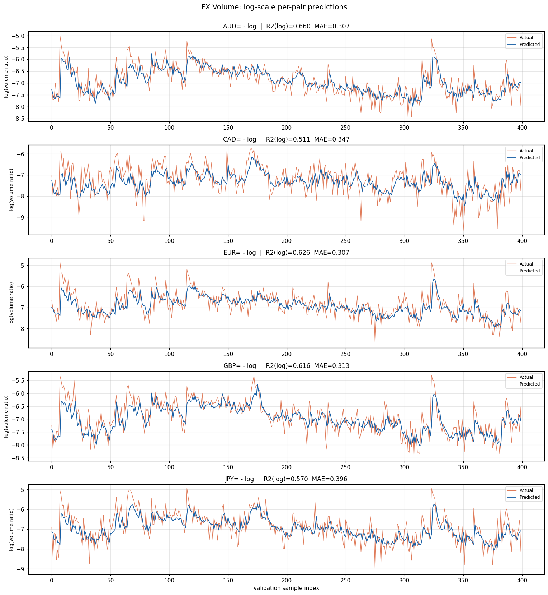{fig-alt="FX log-volume predictions"}](fig/projects/hsbc-fx-volume-forecast.png)

*Observed and predicted FX log-volume ratios across five currency pairs.*
:::

::: {.figure-item}
[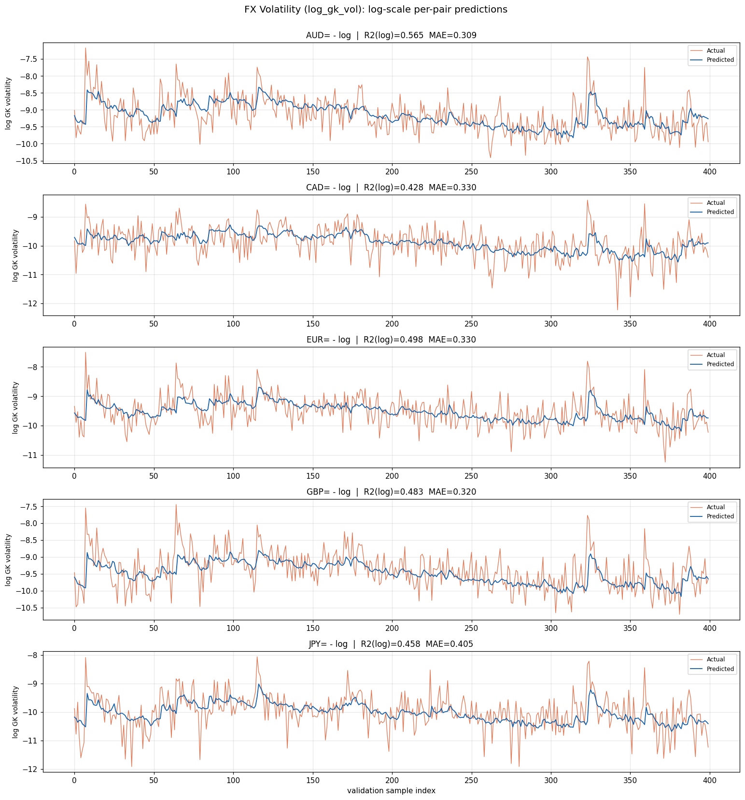{fig-alt="FX log-volatility predictions"}](fig/projects/hsbc-fx-volatility-forecast.png)

*Observed and predicted log realized volatility across five FX pairs.*
:::

::: {.figure-item}
[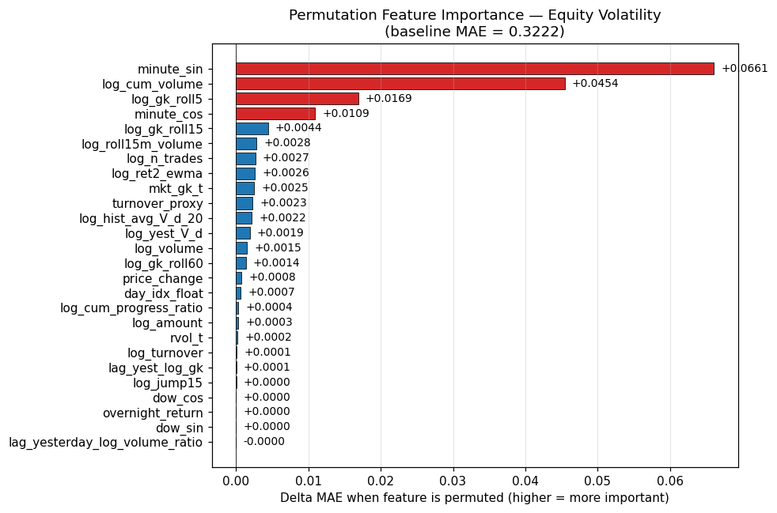{fig-alt="Equity-volatility feature importance"}](fig/projects/hsbc-equity-volatility-feature-importance.png)

*Permutation feature importance for the equity-volatility target.*
:::

::: {.figure-item}
[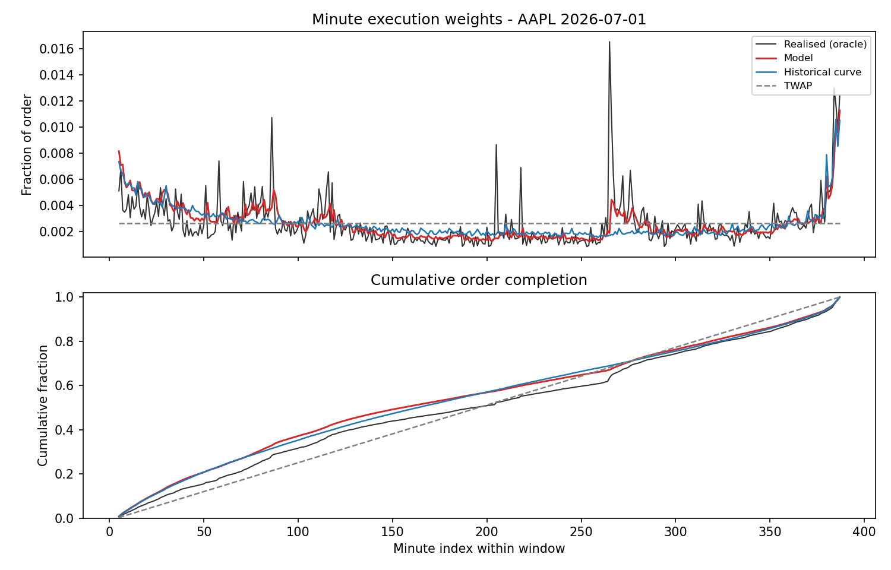{fig-alt="Equity execution example"}](fig/projects/hsbc-equity-execution.png)

*Model-implied minute weights and cumulative completion for an equity order.*
:::

::: {.figure-item}
[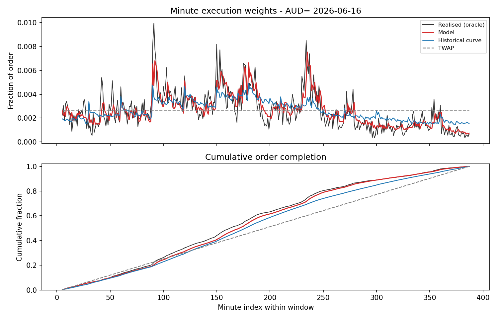{fig-alt="FX execution example"}](fig/projects/hsbc-fx-execution.png)

*FX execution schedules under the model, historical profile, and TWAP.*
:::
::::

---

## 02 · Cryptocurrency Direction Forecasting with Machine Learning {#project-crypto-ml}

::: {.project-meta}
UCL MSc · Advanced Machine Learning Coursework · 2026
:::

::: {.project-lead}
This project compared logistic regression, LSTM, and Transformer models for predicting the direction of hourly BTC and ETH returns. The analysis emphasized chronological evaluation and the question of whether added sequence-model complexity produces stable out-of-sample gains in a low-signal financial setting.
:::

:::: {.project-summary-grid}
::: {.summary-panel}
### Workflow

- Cleaned and aligned hourly BTCUSDT and ETHUSDT price histories and constructed log returns.
- Used chronological train, validation, and test partitions to prevent future information from entering model selection.
- Compared a transparent linear classifier with recurrent and attention-based neural networks.
:::

::: {.summary-panel}
### Results

- Predictability was weak overall, with test AUC values close to 0.5.
- For BTC, the Transformer was marginally strongest (AUC 0.547), followed by LSTM (0.541) and logistic regression (0.532).
- For ETH, logistic regression performed best (AUC 0.548), while LSTM and Transformer were close to random ranking.
:::
::::

::: {.project-tools}
`Logistic regression` `LSTM` `Transformer` `BTC` `ETH` `ROC–AUC` `Time-series validation`
:::

:::: {.figure-grid .cols-2}
::: {.figure-item}
[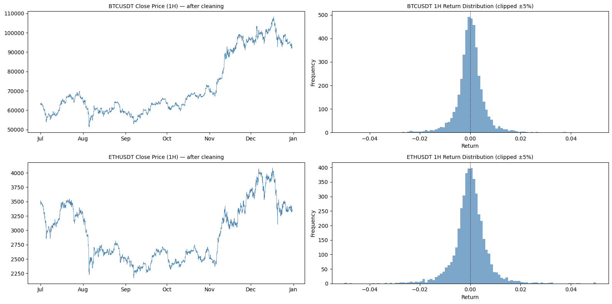{fig-alt="BTC and ETH exploratory data analysis"}](fig/projects/crypto-direction-eda.png)

*Cleaned hourly prices and log-return distributions for BTC and ETH.*
:::

::: {.figure-item}
[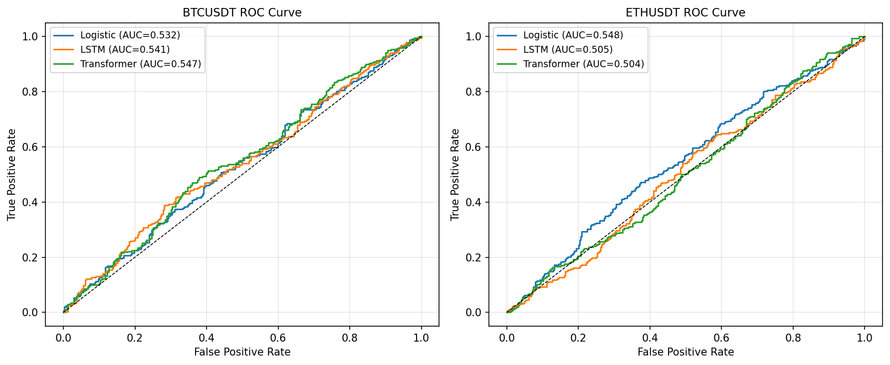{fig-alt="BTC and ETH ROC curves"}](fig/projects/crypto-direction-roc.png)

*Test ROC curves for logistic regression, LSTM, and Transformer classifiers.*
:::
::::

---

## 03 · Algorithmic Trading Strategies for Cryptocurrency Markets {#project-trading}

::: {.project-meta}
UCL MSc · Algorithmic Trading Coursework · 2026
:::

::: {.project-lead}
I designed and evaluated two systematic cryptocurrency strategies using Binance one-minute data: a cross-asset mean-reversion strategy and a BNB–DOGE cointegration pairs strategy. The backtest separated signal construction, position sizing, portfolio aggregation, and implementation costs.
:::

:::: {.project-summary-grid}
::: {.summary-panel}
### Research design

- BTCUSDT, ETHUSDT, BNBUSDT, and DOGEUSDT observations sampled into 15-minute decision intervals.
- Volatility-targeted position sizing and portfolio-level risk aggregation.
- Transaction-cost estimates derived from the Roll model and incorporated into net performance.
:::

::: {.summary-panel}
### Interpretation

- Compared short-horizon reversal with relative-value convergence as distinct sources of predictability.
- Reported gross and net-of-slippage performance instead of relying on frictionless results.
- Examined regime dependence and the sensitivity of short-horizon strategies to execution assumptions.
:::
::::

::: {.project-tools}
`Python` `Binance data` `Mean reversion` `Cointegration` `Volatility targeting` `Backtesting` `Transaction costs`
:::

:::: {.figure-grid .cols-2}
::: {.figure-item}
[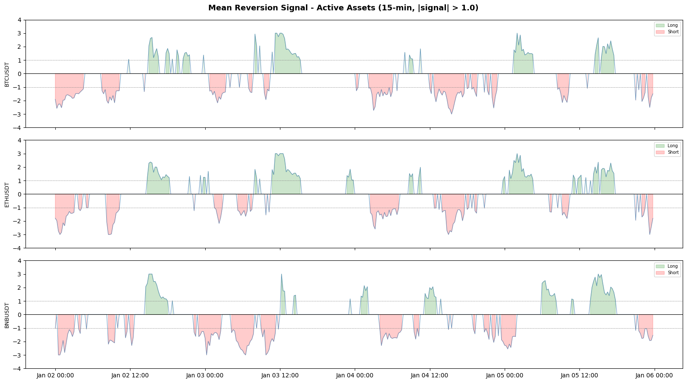{fig-alt="Cryptocurrency mean-reversion signals"}](fig/projects/crypto-mean-reversion-signals.png)

*Fifteen-minute long and short signals across the actively traded assets.*
:::

::: {.figure-item}
[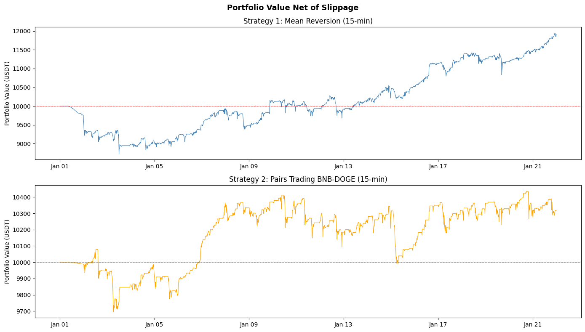{fig-alt="Cryptocurrency strategy backtests"}](fig/projects/crypto-strategy-backtest.png)

*Portfolio value for the mean-reversion and pairs strategies after estimated slippage.*
:::
::::

---

## 04 · Probability Calibration in U.S. Recession Forecasting {#project-recession}

::: {.project-meta}
UCL MSc · Data Science Coursework · 2026
:::

::: {.project-lead}
This project examined whether predicted recession probabilities were empirically reliable, rather than evaluating models only by their ability to rank observations. I forecast U.S. recessions one, two, and three quarters ahead and compared discrimination with probability calibration.
:::

:::: {.project-summary-grid}
::: {.summary-panel}
### Methods

- Sparse L1-regularized logistic regression and tuned XGBoost classifiers.
- Platt scaling, isotonic regression, and temperature scaling.
- Walk-forward leave-one-split-out calibration preserving chronological order.
:::

::: {.summary-panel}
### Evaluation

- Compared Brier score, log loss, expected calibration error, and AUC.
- Calibration generally improved probability accuracy, although gains could reduce ranking performance.
- Platt scaling was the most consistent; isotonic regression was more prone to small-sample overfitting.
:::
::::

::: {.project-tools}
`scikit-learn` `XGBoost` `Probability calibration` `Macroeconomic forecasting` `Walk-forward validation`
:::

:::: {.figure-grid .cols-2}
::: {.figure-item}
[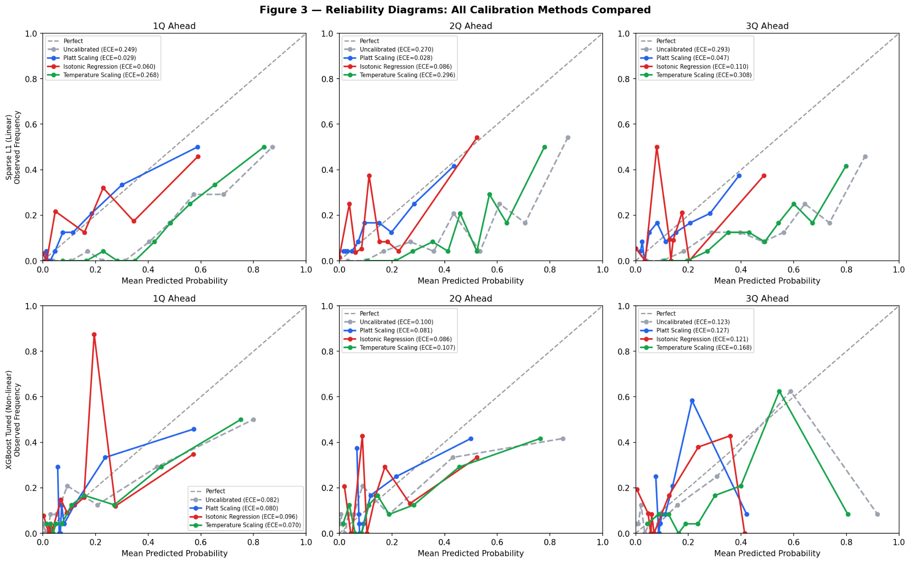{fig-alt="Recession reliability diagrams"}](fig/projects/recession-calibration-comparison.png)

*Reliability diagrams comparing calibration methods across forecast horizons.*
:::

::: {.figure-item}
[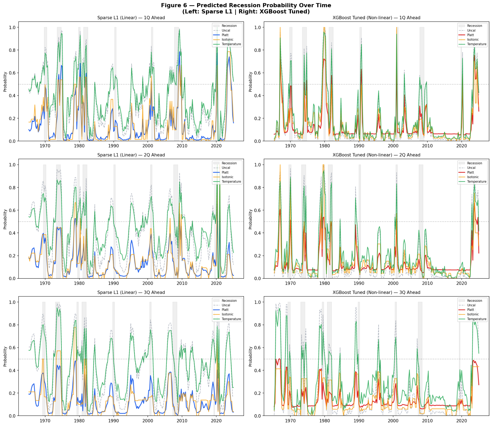{fig-alt="Predicted recession probability paths"}](fig/projects/recession-probability-paths.png)

*Predicted recession probabilities over time for the linear and XGBoost models.*
:::
::::

---

## 05 · Chaos and Hopf Bifurcation in a Financial System {#project-chaos}

::: {.project-meta}
UCL BSc · Research Project · 2024
:::

::: {.project-lead}
In this research project, I reproduced and explored a three-state nonlinear financial system linking the interest rate, investment demand, and price index. I derived the stability conditions and implemented the numerical analysis to study how parameter changes and initial conditions alter the system's long-run behavior.
:::

::: {.equation-panel}
$$
\dot{x}=z+(y-a)x, \qquad
\dot{y}=1-by-x^2, \qquad
\dot{z}=-x-cz.
$$
:::

:::: {.project-summary-grid}
::: {.summary-panel}
### Analysis

- Derived equilibrium points and studied local stability through the Jacobian and its eigenvalues.
- Simulated trajectories under alternative saving-rate parameters and initial conditions.
- Examined a delayed-feedback extension for investment demand and the associated Hopf-bifurcation conditions.
:::

::: {.summary-panel}
### Visualization

- Produced three-dimensional trajectories and two-dimensional phase projections.
- Used parameter sweeps and bifurcation diagrams to identify qualitative regime changes.
- Connected stable equilibria, periodic motion, and chaotic behavior to the model parameters.
:::
::::

::: {.project-tools}
`Python` `MATLAB` `Nonlinear ODEs` `Dynamical systems` `Stability analysis` `Chaos` `Hopf bifurcation`
:::

:::: {.figure-grid .cols-3}
::: {.figure-item}
[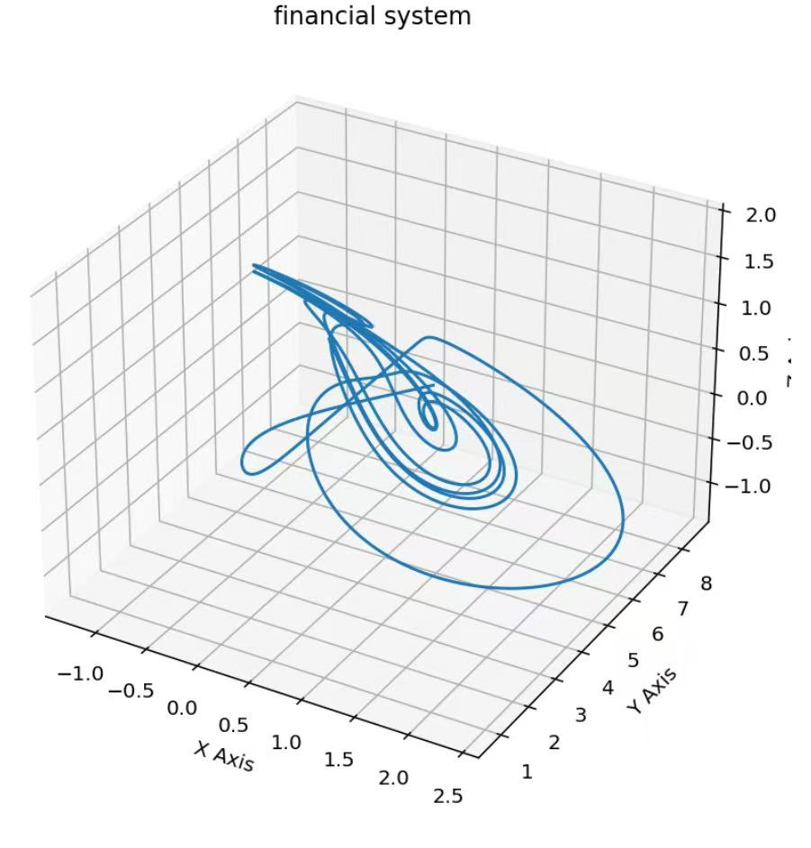{fig-alt="Three-dimensional financial-system trajectory"}](fig/projects/financial-chaos-attractor.jpg)

*Three-dimensional trajectory of the nonlinear financial system.*
:::

::: {.figure-item}
[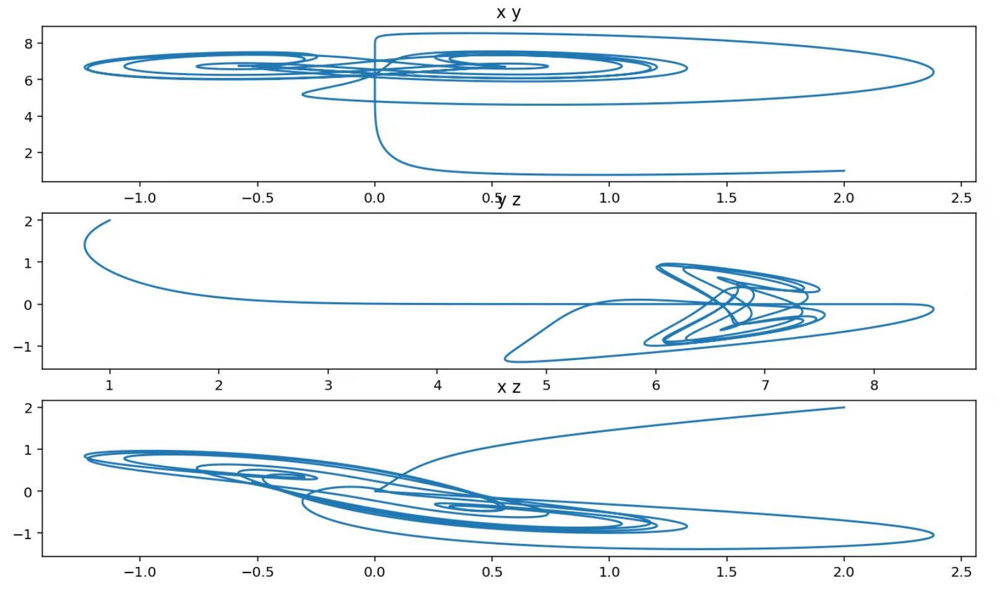{fig-alt="Financial-system phase projections"}](fig/projects/financial-chaos-phase-plots.jpg)

*Phase-plane projections showing the geometry of the simulated trajectory.*
:::

::: {.figure-item}
[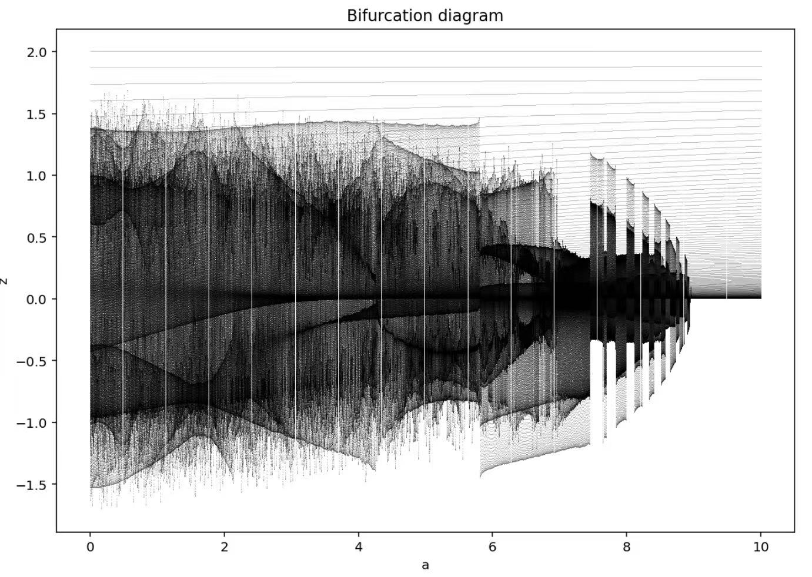{fig-alt="Financial-system bifurcation diagram"}](fig/projects/financial-chaos-bifurcation.jpg)

*Bifurcation diagram illustrating qualitative changes as a parameter varies.*
:::
::::